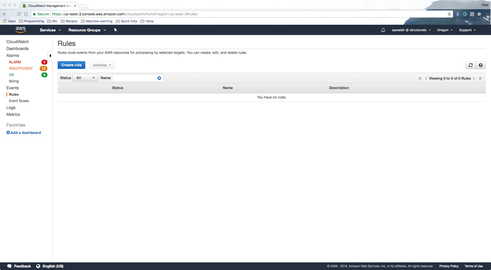
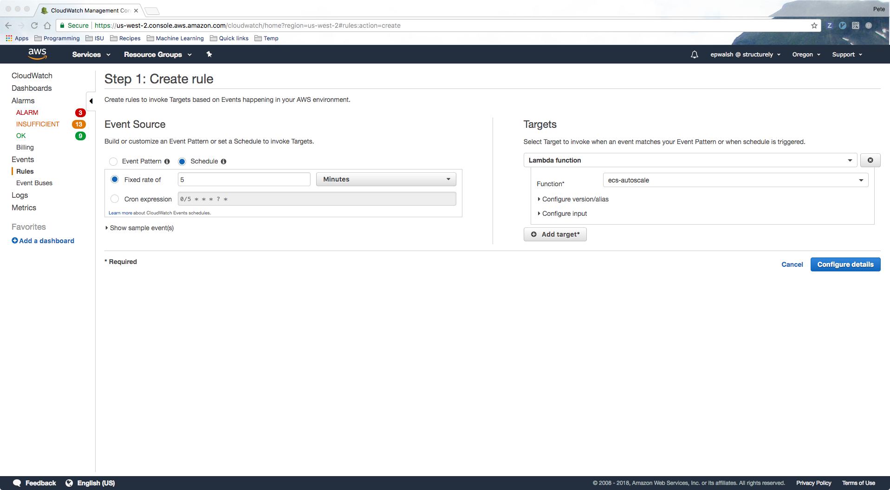

# ecs-autoscale

This is a Lambda function that allows you to automatically
scale EC2 instances and services within an ECS cluster simultaneously based on 
arbitrary metrics from sources not limited to CloudWatch.

## Requirements

Make sure you have Python 3.5 or 3.6 and have installed the requirements
listed in `requirements.txt` (`pip3 install -r requirements.txt`). 
Currently this has only been testing on OS X and Linux. Windows is not supported.

## Quick start

Suppose we want to set up autoscaling for a cluster on ECS called `my_cluster`
with two services running: `backend` and `worker`. Suppose `backend` is just a simple
web server and `worker` is a [celery](http://www.celeryproject.org) worker 
for handling long-running tasks for the web server with a RabbitMQ instance as the broker.

In this case we want to scale the web server based on CPU utilization and scale the
celery worker based on the number of waiting tasks (which is given by the number of `ready` 
messages on the RabbitMQ instance).

**Step 1: Define the cluster scaling requirements**

We create a YAML file `./python-lambda/clusters/my_cluster.yml`.

> NOTE: The name of the YAML file sans extension must exactly match the name of the cluster on ECS.

Our cluster definition will look like this:

```yaml
# Exact name of the autoscaling group.
autoscale_group: EC2ContainerService-my_cluster-EcsInstanceAsg-AAAAA

# Set to false to ignore this cluster when autoscaling.
enabled: true

# Buffer room: you can think of this as an empty service / task.
cpu_buffer: 0  # Size of buffer in CPU units.
mem_buffer: 0  # Size of buffer in memory.

# Defines scaling for individual services.
services:
  # This should be the exact name of the service as in the ECS cluster.
  worker:
    # Set to false to ignore service when autoscaling.
    enabled: true

    min: 1  # Min number of tasks.
    max: 3  # Max number of tasks.

    metric_sources:
      # Data sources needed for gathering metrics. Currently only `rabbitmq` and 
      # `cloudwatch` are supported. Only one statistic from one source is needed.
      # For more information on the metrics available, see below under "Metrics".
      rabbitmq:
        - url: https://username:password@my_rabbitmq_host.com/api/queues/celery
          statistics:
            - name: messages_ready
              alias: queue_length

    # Autoscaling events which determine when to scale up or down.
    events:
      - metric: queue_length  # Name of metric to use.
        action: 1  # Scale up by one.
        # Conditions of the event:
        min: 5
        max: null
      - metric: queue_length
        action: -1  # Scale down by one.
        min: null
        max: 3

  backend:
    enabled: true
    min: 1
    max: 3
    metric_sources:
      cloudwatch:
        - namespace: AWS/ECS
          metric_name: CPUUtilization
          dimensions:
            - name: ClusterName
              value: my_cluster
            - name: ServiceName
              value: backend
          period: 300
          statistics:
            - name: Average
              alias: cpu_usage

    events:
      - metric: cpu_usage
        action: 1  # Scale up by 1
        min: 10
        max: null
      - metric: cpu_usage
        action: -1  # Scale down by 1
        min: null
        max: 1
```

> NOTE: You may not want to store sensitive information in your cluster definition,
such as the username and password in the RabbitMQ URL above. In this case you could store
those values in environment variables and pass them to the cluster definition
using our special syntax: `%(VARIABLE_NAME)`. So, for example, suppose
we have the environment variables `USERNAME` and `PASSWORD`. Then the line above
with the url for RabbitMQ would become `url: https://%(USERNAME):%(PASSWORD)@my_rabbitmq_host.com/api/queues/celery`.


**Step 2: Test the function locally**

To test the function locally,

```bash
cd ./python-lambda/ && python3 lambda_function.py --test
```

> NOTE: The `--test` switch ensures that no actual scaling events will occur,
it's just a simulation.


**Step 3: Setup and deployment**

Run the script `./bootstrap.sh`. This will

- Create a Python 3 virtualenv called `ecs-autoscale`.
- Install the requirements to that virtualenv.
- Create a symbolic link `python-lambda/packages` to the site-packages directory of that virtualenv.
- Create an IAM policy that gives access to the resources the lambda function will need.
- Create a role for the Lambda function to use, an attach the policy just created to that role.
- Build a deployment package.
- Create a Lambda function with the role attached and upload the deployment package.


**Step 5: Create a trigger to execute your function**

In this example we will create a simple CloudWatch that triggers our Lambda function to run
every 5 minutes.

To do this, first login to the AWS Console and the go to the CloudWatch service. On the left side menu,
click on "Rules". You should see a page that looks like this:



Then click "Create rule" by the top. You should now see a page that looks like this:



Make sure you check "Schedule" instead of "Event Pattern", and then set it to a fixed
rate of 5 minutes. Then on the right side click "Add target" and choose "ecs-autoscale"
from the drop down.

Next click "Configure details", give your rule a name, and then click "Create rule".

You're all set! After 5 minutes your function should run.


## Details

### Scaling

#### Scaling individual services

Individual services can be scaled up or down according to arbitrary metrics. For example,
celery workers can be scaled according to the number of queued messages.

#### Scaling up the cluster

A cluster is triggered to scale up by one instance when both of the following two conditions are met:

- the desired capacity of the corresponding autoscaling group is less than the maximum capacity, and
- the additional tasks for services that need to scale up cannot fit on the existing 
instances with room left over for the predefined CPU and memory buffers.

#### Scaling down the cluster

A cluster is triggered to scale down by one instance when both of the following two conditions are met:

- the desired capacity of the corresponding autoscaling group is greater than the minimum capacity, and
- all of the tasks on the EC2 instance in the cluster with either the smallest amount of 
reserved CPU units or memory could fit entirely on another instance in the cluster, and 
so that the other instances could still support all additional tasks for services that need
to scale up with room left over for the predefined CPU and memory buffers.

## Metrics

### Sources

#### Cloudwatch

#### RabbitMQ

### Metric arithmetic
